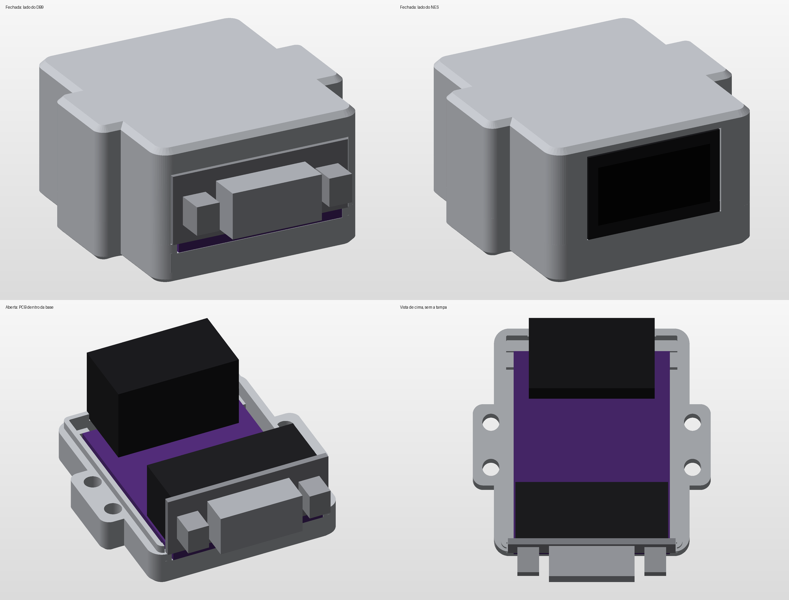
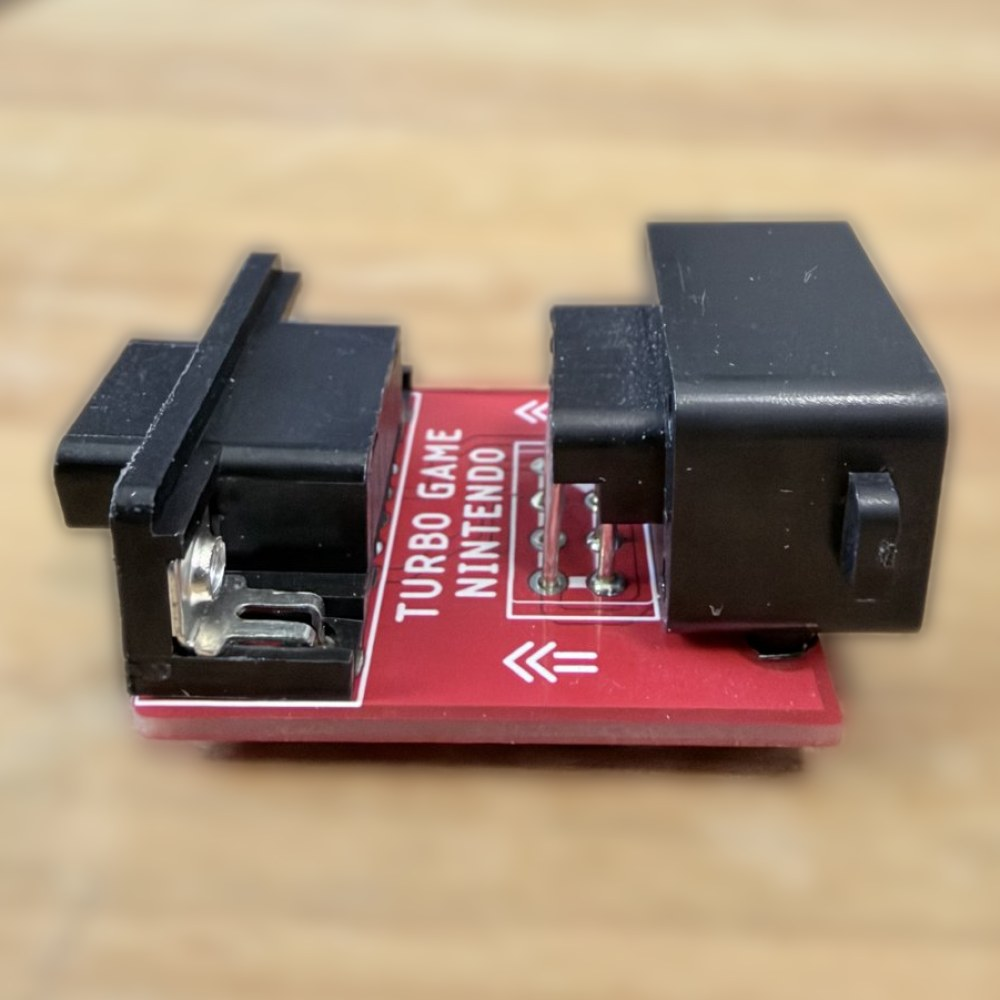
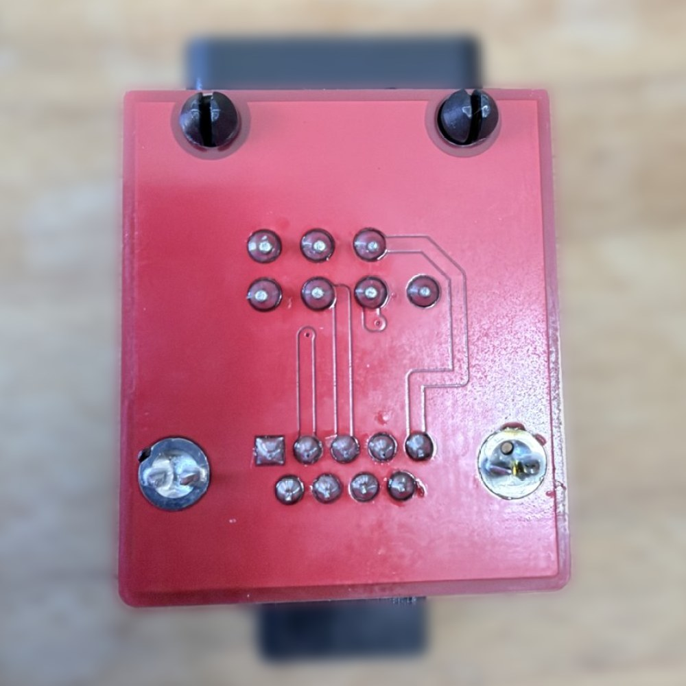
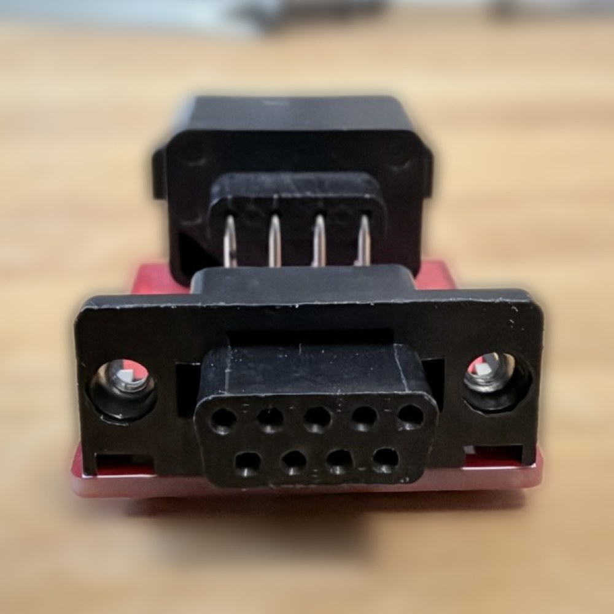
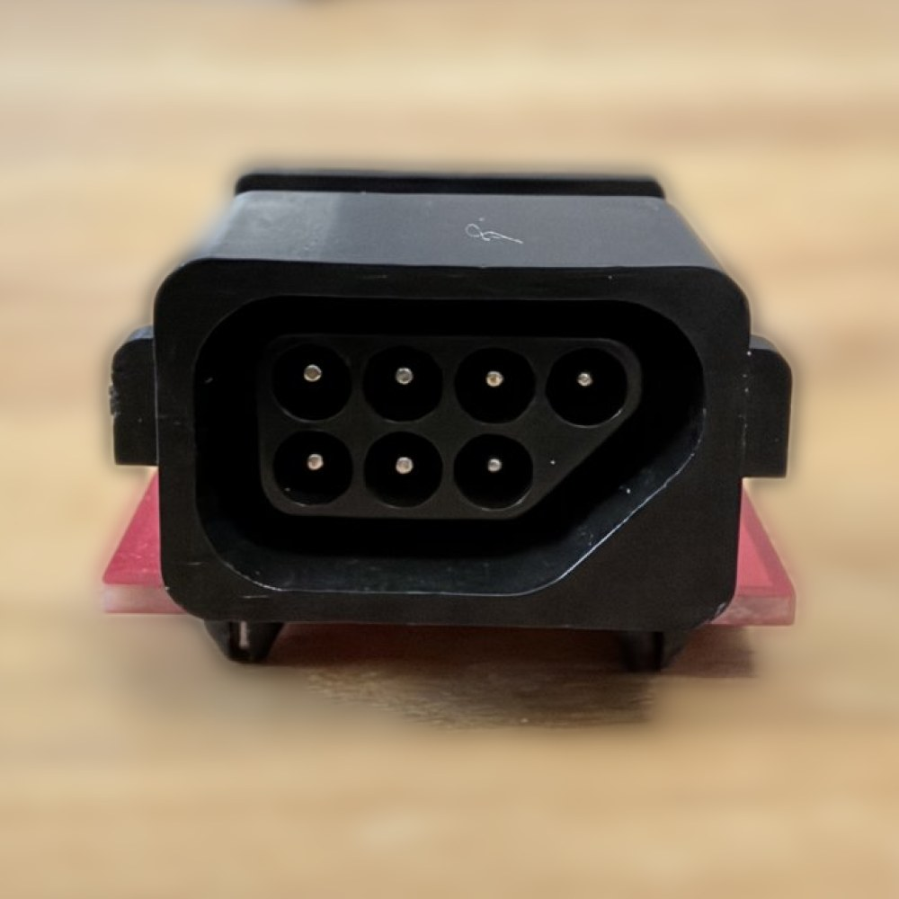

# Adaptador NES para Famiclones Brasileiros: Geniecom, Phantom System, Top Game e Turbo Game

Documentação da pinagem do controle de famiclones vendidos no Brasil e projeto de adaptadores (cabo e PCB) para usar controles de NES, inclusive o 8BitDo Retro Receiver, neles. O motivador original deste repositório foi o Geniecom (DB9/DE9); a documentação do Phantom System, do Top Game e do Turbo Game (que compartilham a mesma pinagem entre si) foi incluída depois, como bônus.

## Sumário

- [Objetivo](#objetivo)
- [Referências](#referências)
- [Pinagem](#pinagem)
- [Terminologia](#terminologia)
- [Correlação Geniecom ↔ NES](#correlação-geniecom--nes)
- [Montando o adaptador](#montando-o-adaptador)
- [PCB (Gerber)](#pcb-gerber)
- [Case para impressão 3D](#case-para-impressão-3d)
- [Bônus: outros clones](#bônus-outros-clones)
  - [Phantom System, Top Game e Turbo Game](#phantom-system-top-game-e-turbo-game)
- [Estrutura do repositório](#estrutura-do-repositório)
- [Créditos](#créditos)
- [Licença](#licença)

## Objetivo

Recuperar a memória deste simpático Famiclone e documentar a pinagem do joystick dele. O objetivo prático é usar o [8BitDo Retro Receiver](https://www.8bitdo.com/retro-receiver-nes/) no Geniecom, jogando com controles sem fio como já faço no NES. Para isso, é preciso conhecer o mapa de pinagem do Geniecom e ligar o conector DB9/DE9 dele ao conector de 7 pinos do NES.

Para saber mais sobre o console, veja [este artigo no Bojoga](https://bojoga.com.br/acervo/consoles-de-mesa/geracao-3/geniecom/). A história completa do projeto está em [docs/historia.md](docs/historia.md).

## Referências

- O NES usa um [conector de 7 pinos](https://www.nesdev.org/wiki/Controller_port_pinout).
- O Geniecom usa o conector DB9/DE9. [Saiba mais sobre ele aqui](http://www.nullmodem.com/DB-9.htm).
- Vídeo de referência de um adaptador semelhante, do [canal do Cirne](https://youtu.be/fYj5p7F7-cc):

  [](https://youtu.be/fYj5p7F7-cc)

- Se você tem um Phantom System, Top Game, Geniecom ou Turbo Game, o Lucas Guilherme vende adaptadores prontos. [Confira aqui](https://shopee.com.br/shop/353762657).

## Pinagem

### Geniecom, visto pelo lado do controle

Perspectiva de quem olha o conector pelo lado do controle: o pino 5 fica à esquerda e o pino 1 à direita.


### Geniecom, visto pelo lado do console

Perspectiva de quem olha o conector do console de frente: o pino 1 fica à esquerda e o pino 5 à direita.


### Famicom e Geniecom (porta DB15)

A pinagem da porta DB15 do Geniecom segue o mesmo padrão do Famicom. A Light Gun do Famicom funciona no Geniecom (testado e confirmado). Com um [adaptador Famicom → NES](https://misteraddons.com/products/nes-controllers-to-famicom-console-adapter), consegui conectar dois controles de NES e uma [Zapper](https://en.wikipedia.org/wiki/NES_Zapper) ao Geniecom.


### NES


### Famicom (DB15) e portas do NES

Ligação entre a porta DB15 no padrão Famicom (exemplo: TwinHead PC-100) e as portas de controle 1 e 2 do NES. Os fios de Ground, Power e Latch são compartilhados pelas duas portas.


## Terminologia

- **Latch** e **Strobe** são o mesmo sinal. Nos diagramas e tabelas, aparece como "Latch or Strobe".
- **Power** e **VCC +5V** são a mesma alimentação de 5 V. Aparece como "Power or VCC +5V".
- **Ground** é o terra (GND).

## Correlação Geniecom ↔ NES

Para ligar um controle de NES ao Geniecom, cada função do DB9 do Geniecom vai para o pino de mesma função no conector do NES. Os números do DB9 abaixo são os pinos físicos do conector, como nos diagramas de pinagem acima.

| Função | Pino DB9 (Geniecom) | Pino NES |
| --- | --- | --- |
| Ground | 1 | 1 |
| Sound | 2 | Não usado (o NES não tem essa função) |
| Latch or Strobe | 3 | 3 |
| Data | 5 | 4 |
| Clock | 6 | 2 |
| Power or VCC +5V | 9 | 5 |
| Sem função | 4, 7 e 8 | 6 e 7 (D3 e D4, usados pela Zapper; não ligados) |

Fontes: os diagramas de pinagem do Geniecom acima e a [pinagem da porta de controle do NES](https://www.nesdev.org/wiki/Controller_port_pinout). Esta correlação vale tanto para o cabo adaptador quanto para a [PCB](#pcb-gerber).

## Montando o adaptador

> **Atenção:** o Geniecom e o NES alimentam o controle com +5 V no pino de Power. Antes de ligar um controle ou adaptador ao console, confirme com um multímetro (modo continuidade, com tudo desligado) que o fio de Power vai ao pino 9 do DB9 e ao pino 5 do NES, e que o Ground não está em curto com o Power. Uma inversão de polaridade pode queimar o controle, o Retro Receiver ou o console.

Os conectores DB9/DE9 machos do Geniecom são muito longos. Por isso, o conector fêmea também precisa ser longo o bastante para a conexão ficar firme, sem folgas. Para fazer o adaptador, comprei:

- [Cabo extensor para controle de Mega Drive](https://www.aliexpress.com/item/4000095438635.html)
- [Cabo extensor para controle de NES](https://www.aliexpress.com/item/4000029468234.html)
- [Anel de ferrite para cabo, 5 mm](https://www.aliexpress.com/item/1005006071819843.html)

Cortei os cabos dos dois extensores e liguei entre si os fios de mesma função. O Mega Drive e o NES são usados só como fonte de conector e fio: o que importa é a função que cada fio assume no Geniecom e no NES.

### Mapa de ligação

Cada linha do diagrama é uma função. Leia da esquerda para a direita: o pino do DB9 (lado Geniecom), a cor do fio correspondente no cabo do Mega Drive, a função, a cor do fio do cabo do NES que deve ser emendado a ele e o pino do NES. A cor da linha identifica a função, e as cores dos fios são as dos cabos que usei.


| Função | Cor do fio (Mega Drive) | Cor do fio (NES) |
| --- | --- | --- |
| Ground | Vermelho | Branco |
| Clock | Verde | Verde |
| Latch or Strobe | Cinza | Amarelo |
| Data | Marrom | Preto |
| Power or VCC +5V | Amarelo | Vermelho |
| Sound | Preto | Não ligado |
| Sem função | Laranja, Branco e Azul (isolar) | Não usado |

Os números dos pinos estão no diagrama e na tabela de [correlação](#correlação-geniecom--nes). Se os seus cabos tiverem outras cores, descubra com o multímetro qual fio sai de cada pino e emende pela função: as funções e os pinos valem para qualquer cabo, as cores não.

<details>
<summary>Cores de cada cabo, pino a pino (para conferir com o multímetro)</summary>

**Cabo do Mega Drive (DB9, funções do Geniecom)**

| Pino DB9 (Geniecom) | Cor do fio (Mega Drive) | Função |
| --- | --- | --- |
| 01 | Vermelho | Ground |
| 02 | Preto | Sound |
| 03 | Cinza | Latch or Strobe |
| 04 | Laranja | Não usado |
| 05 | Marrom | Data |
| 06 | Verde | Clock |
| 07 | Branco | Não usado |
| 08 | Azul | Não usado |
| 09 | Amarelo | Power or VCC +5V |

**Cabo do NES (conector de 7 pinos)**

| Pino NES | Cor do fio (NES) | Função |
| --- | --- | --- |
| 01 | Branco | Ground |
| 02 | Verde | Clock |
| 03 | Amarelo | Latch or Strobe |
| 04 | Preto | Data |
| 05 | Vermelho | Power or VCC +5V |
| 06 | Não usado | Não usado |
| 07 | Não usado | Não usado |

</details>

### Resultado final

Esta belezinha!


## PCB (Gerber)

Em junho de 2025, passei a me interessar cada vez mais por eletrônica e retro consoles. Por isso, criei no [EasyEDA](https://easyeda.com/) o projeto de uma [PCB](https://es.wikipedia.org/wiki/Circuito_impreso) com a pinagem que converte NES para Geniecom, para fabricá-la na [JLCPCB](https://jlcpcb.com/). A placa mede 30,9 × 40,3 mm e tem 1,26 mm de espessura.

Os arquivos estão disponíveis para quem quiser usar ou modificar:

| Arquivo | Descrição |
| --- | --- |
| [hardware/gerber_geniecom.zip](hardware/gerber_geniecom.zip) | Gerber, pronto para enviar à fábrica de PCB |
| [hardware/easyeda/geniecom_pcb.json](hardware/easyeda/geniecom_pcb.json) | Layout da PCB, arquivo-fonte editável (importe no EasyEDA) |
| [hardware/easyeda/geniecom_sch.json](hardware/easyeda/geniecom_sch.json) | Esquemático, arquivo-fonte editável (importe no EasyEDA) |
| [hardware/easyeda/geniecom_pcb.pdf](hardware/easyeda/geniecom_pcb.pdf) | Visualização do layout |
| [hardware/bom_geniecom.csv](hardware/bom_geniecom.csv) | Lista de materiais (BOM) |

Façam bom proveito!

### Lista de materiais

| Designador | Descrição | Qtd. | Compra |
| --- | --- | --- | --- |
| NES | Conector de controle NES, 7 pinos fêmea, ângulo reto | 1 | [AliExpress](https://www.aliexpress.com/item/32828024202.html) |
| Geniecom | Conector DB9 fêmea, ângulo reto | 1 | [AliExpress](https://www.aliexpress.com/item/4001214300548.html) |

### Ligações da PCB

A PCB implementa a [correlação Geniecom ↔ NES](#correlação-geniecom--nes) acima.

> **Nota sobre o EasyEDA:** o footprint do DB9 fêmea usado no projeto tem os pads numerados de forma espelhada em relação aos pinos físicos (pad 1 ↔ pino 5, pad 2 ↔ pino 4, pad 6 ↔ pino 9 e pad 7 ↔ pino 8; o pad 3 coincide). Por isso, o esquemático e o layout mostram, por exemplo, "DB9 1 → NES 4", que corresponde ao Data (pino físico 5) no NES. Se você editar o projeto, mantenha esse espelhamento.

### PCB montada

A placa chegou e foi montada com os dois conectores.

| | |
| --- | --- |
|  |  |
| Vista geral: conector DB9 (lado Geniecom) e conector NES. | Verso da placa, com os terminais dos conectores. |
|  |  |
| Conector DB9 fêmea, que encaixa no Geniecom. | Conector NES de 7 pinos, que recebe o controle ou o Retro Receiver. |

## Case para impressão 3D

Case sob medida para a [PCB do Geniecom](#pcb-gerber) montada (PCB, DB9 e conector NES soldados), sem nada exposto e sem "alças": é uma caixa de laterais retas. A moldura do DB9 e o corpo do NES atravessam a parede e ficam com a face rente à face externa, então a carcaça D do DB9 sai inteira (encaixe completo no console) e o plugue do controle entra direto no NES. São duas peças: a **casca** (paredes e teto, com as janelas dos conectores) e a **placa do fundo**, que fecha a caixa por baixo. Geradas por script (CadQuery) e exportadas em STL e STEP. Para o Phantom System, Top Game e Turbo Game, veja a [case do Phantom](#case-para-impressão-3d-do-phantom-system-top-game-e-turbo-game).

> **Status:** impressa e validada. As molduras do DB9 e do NES encaixam sem folga, o fecho com 4 parafusos M3×8 mm fecha perfeitamente e os conectores não se movem ao encaixar o plugue (os batentes das orelhas do NES resolveram o recuo da PCB). Os nomes gravados no teto saíram como esperado.



| Arquivo | Descrição |
| --- | --- |
| [model3d/geniecom/stl/case_base.stl](model3d/geniecom/stl/case_base.stl) | Placa do fundo, com os apoios da PCB e as abas das janelas, pronta para imprimir (fundo na mesa) |
| [model3d/geniecom/stl/case_lid.stl](model3d/geniecom/stl/case_lid.stl) | Casca (paredes e teto), já virada para imprimir (teto na mesa) |
| [model3d/geniecom/stl/case_assembly.stl](model3d/geniecom/stl/case_assembly.stl) | Conjunto montado, só para conferência visual |
| [model3d/geniecom/autodeskfusion/case_geniecom.py](model3d/geniecom/autodeskfusion/case_geniecom.py) | Script paramétrico (CadQuery) que gera todos os arquivos |
| [model3d/geniecom/autodeskfusion/case_base.step](model3d/geniecom/autodeskfusion/case_base.step), [case_lid.step](model3d/geniecom/autodeskfusion/case_lid.step), [case_assembly.step](model3d/geniecom/autodeskfusion/case_assembly.step) | Para importar no Autodesk Fusion (*Inserir > Inserir arquivo STEP*); a geometria vem editável, sem histórico paramétrico |

### Material necessário

- Impressão 3D: `case_base.stl` (placa do fundo) e `case_lid.stl` (casca). Não imprima o `case_assembly.stl`, que é só para visualização.
- Parafusos: **4 × M3×8 mm**, autorroscantes, de cabeça escareada (cabeça de Ø4,94 mm), colocados pelo fundo da placa.
- A PCB já montada, com o DB9 e o conector NES soldados.
- Opcional: os [testes de encaixe](model3d/frame-tests/README.md) do DB9 e do NES, para conferir a folga na sua impressora antes de imprimir a case.

### Características

- Medidas dos conectores conferidas com paquímetro e com o layout da PCB ([hardware/easyeda/geniecom_pcb.json](hardware/easyeda/geniecom_pcb.json)). Janelas do DB9 e do NES recortadas com a folga validada nos testes de encaixe, e a janela do NES acompanha os cantos boleados do conector (raio de 2 mm).
- A PCB fica apoiada em quatro blocos pequenos nos cantos da placa do fundo (dois na frente e dois atrás). Na casca, quatro peças seguram a PCB no sentido do comprimento: dois pilares na frente e dois batentes atrás das orelhas do conector NES, com 0,15 mm de folga cada, de modo que o empurrão do plugue do joystick no DB9 não desloca a placa. A folga vertical dos pilares sobre a PCB é de 0,1 mm.
- Nenhum milímetro de encaixe é perdido no lado do DB9: a carcaça D sai inteira (6 mm) e a moldura do DB9 sai 0,3 mm além da face frontal da case, o que cobre a folga de posição da PCB (a moldura pode ficar entre 0,13 e 0,5 mm para fora, nunca para dentro). A parede frontal, abaixo da PCB, é fechada por uma aba da placa do fundo.
- Espaço de 4,25 mm sob a PCB para os pinos de fixação do NES (3,75 mm), os pinos soldados e as cabeças dos parafusos do DB9.
- As janelas do DB9 e do NES descem até a placa do fundo, então a casca não tem "ponte" na impressão. As abas da placa tapam o vão sob os conectores (folga de 0,15 mm), e a emenda fica abaixo da PCB, não em volta dos conectores.
- Quatro parafusos **M3×8 mm autorroscantes de cabeça escareada**, um em cada canto: a cabeça fica embutida no fundo da placa e a haste rosqueia em furos-piloto de 2,6 mm dentro da parede lateral (6,5 mm de espessura, 6 mm de rosca). Os parafusos ficam a 6,5 mm das faces do DB9 e do NES, no eixo da parede.
- Os nomes **GENIECOM** (perto do DB9) e **NES** (perto do NES) estão gravados no teto, em baixo-relevo de 0,4 mm, com letras de uns 4,5 mm de altura. Cada nome se lê do lado do seu conector: GENIECOM de quem olha pelo lado do DB9 e NES de quem olha pelo lado do NES. A gravação (e não o alto-relevo) é porque a casca imprime com o teto na mesa. A fonte é a negrito padrão do CadQuery; em outra máquina ela pode cair em outra fonte parecida.
- Dimensões externas: cerca de 44,7 × 44,5 × 26,7 mm (a placa do fundo tem 2 mm). A cavidade tem 31,6 mm de largura (a moldura do DB9 tem 30,95 mm) e 22,7 mm de altura livre.

### Impressão

PLA, camada de 0,2 mm, 3 paredes, sem suporte. Os STLs já estão na orientação de impressão. Folgas pensadas para FDM com bico de 0,4 mm; ajuste os parâmetros do script para outra impressora.

### Medidas a conferir

As larguras e alturas dos conectores foram conferidas com paquímetro (as medidas do NES e do DB9 são as mesmas no Geniecom e no Phantom). Parâmetros do Geniecom:

| Parâmetro | Valor | Observação |
| --- | --- | --- |
| `nes_h` | 16,8 mm | Mesmo recorte do teste de encaixe impresso do NES (24,88 × 16,8 mm, folga 0,05 mm, perfeito com 1 furo). Define a altura total da case |
| `db9_h` | 12,74 mm | Medido: 14,0 mm no total com a PCB de 1,26 mm (confirmado no teste de encaixe impresso) |
| `db9_body_w` | 30,95 mm | Largura da moldura do DB9: medida com paquímetro (30,93 mm) |
| `db9_axis_h` | 5,9 mm | Medido: borda de baixo da abertura a 2,68 mm e a de cima a 9,1 mm do plano da PCB; o centro fica em 5,9 mm. Só entra na checagem de interferência |
| `nes_body_w` | 24,88 mm | Medido: largura do conector NES com a moldura. A janela da case tem 0,05 mm de folga de cada lado |
| `nes_front` | 44,79 mm | Medido na PCB do Geniecom montada: distância da face da moldura do DB9 até a face do NES (o layout dá 44,62 mm). No Phantom o valor vem do layout (40,16 mm) |
| `pcb_t` | 1,26 mm | Espessura da PCB do Geniecom, medida |
| `under_h` | 4,25 mm | Espaço sob a PCB: pinos de fixação do NES de 3,75 mm mais 0,5 mm de margem |
| `db9_clear` | 0,00 mm | Folga da janela do DB9, validada no teste de encaixe impresso |
| `nes_clear` | 0,05 mm | Folga da janela do NES, validada no teste de encaixe impresso |
| `wall` | 6,5 mm | Parede lateral: comporta a haste (Ø2,6 de furo-piloto) e a cabeça escareada de Ø4,94 mm com 0,8 mm de material de cada lado |

Para calibrar as folgas na sua impressora, imprima antes os [testes de encaixe](model3d/frame-tests/README.md) do DB9 e do NES (plaquinhas pequenas). Valores validados: DB9 com folga de 0,00 mm (janela de 30,95 mm) e NES com 0,05 mm por lado (janela de 24,98 × 16,85 mm). Se alguma peça não entrar na sua impressora, aumente `db9_clear` ou `nes_clear`.

### Regenerar

```bash
pip install cadquery
python model3d/geniecom/autodeskfusion/case_geniecom.py
```

O script reescreve os STL e STEP e imprime o resultado do teste de interferência.

## Bônus: outros clones

Pinagem dos demais clones que consegui coletar:


### Phantom System, Top Game e Turbo Game

O Phantom System foi um dos primeiros famiclones brasileiros, lançado pela Gradiente por volta de 1989, numa época em que a Nintendo não demonstrava interesse em lançar o NES oficialmente no país. A placa é basicamente a de um NES, montada numa carcaça que sobrou de um projeto de lançar o Atari 7800 no Brasil, com um controle que lembra o do Mega Drive. Ele usa os mesmos cartuchos de 72 pinos do NES e se tornou o clone mais popular do Brasil. Saiba mais no [Bojogá](https://bojoga.com.br/acervo/consoles-de-mesa/geracao-3/phantom-system/).

O Top Game e o Turbo Game, da CCE, são outros dois famiclones da mesma época que usam a mesma base de projeto: o Top Game (modelos VG-8000 e VG-9000) foi concorrente direto do Phantom System, e o Turbo Game (VG-9000T) chegou em 1991 como sua evolução, trocando de nome e adotando um controle inspirado no do Mega Drive, só que invertido e com botões turbo. Por compartilharem a mesma origem de projeto do controle, a pinagem do conector é a mesma nos três consoles.

Ao contrário do Geniecom, a pinagem do conector DB9 do Phantom System segue exatamente a mesma ordem do conector de 7 pinos do NES: não há remapeamento de função por pino, só ligar "pino a pino".

| Função | Pino DB9 (Phantom System) | Pino NES |
| --- | --- | --- |
| Ground | 1 | 1 |
| Clock | 2 | 2 |
| Latch or Strobe | 3 | 3 |
| Data | 4 | 4 |
| Power or VCC +5V | 5 | 5 |
| Sem função (terra da blindagem do conector) | 6, 7, 8 e 9 | Não usado |

Fonte: o esquemático abaixo, confirmado também no layout da PCB (arquivos na seção seguinte). Essa correlação é a mesma já registrada na tabela "Turbo Game / Phantom System / TCP-3" da imagem de pinagem dos outros clones, acima.


#### PCB (Gerber) do Phantom System, Top Game e Turbo Game

No mesmo projeto do EasyEDA, montei uma segunda PCB com a pinagem do Phantom System (compatível também com o Top Game e o Turbo Game), no mesmo padrão da PCB do Geniecom.

| Arquivo | Descrição |
| --- | --- |
| [hardware/gerber_phantom.zip](hardware/gerber_phantom.zip) | Gerber, pronto para enviar à fábrica de PCB |
| [hardware/easyeda/phantom_pcb.json](hardware/easyeda/phantom_pcb.json) | Layout da PCB, arquivo-fonte editável (importe no EasyEDA) |
| [hardware/easyeda/phantom_sch.json](hardware/easyeda/phantom_sch.json) | Esquemático, arquivo-fonte editável (importe no EasyEDA) |
| [hardware/easyeda/phantom_pcb.pdf](hardware/easyeda/phantom_pcb.pdf) | Visualização do layout |
| [docs/img/svg/phantom_sch.svg](docs/img/svg/phantom_sch.svg) | Visualização do esquemático |
| [hardware/bom_phantom.csv](hardware/bom_phantom.csv) | Lista de materiais (BOM) |


Esta PCB ainda não foi fabricada ou montada; os arquivos acima estão prontos para quem quiser produzi-la.

##### Adaptador montado (ilustração)

Fotos de um adaptador NES para Phantom System, Top Game e Turbo Game já montado, a título de ilustração do resultado: PCB com o conector DB9 fêmea e o conector NES de 7 pinos.

| | |
| --- | --- |
|  |  |
| Vista geral: conector DB9 (lado do console) e conector NES. | Verso da placa, com os terminais dos conectores. |
|  |  |
| Conector DB9 fêmea, que encaixa no console. Atrás dele aparecem os pinos do NES. | Conector NES de 7 pinos, que recebe o controle ou o Retro Receiver. |

##### Lista de materiais

| Designador | Descrição | Qtd. | Compra |
| --- | --- | --- | --- |
| NES | Conector de controle NES, 7 pinos fêmea, ângulo reto | 1 | [AliExpress](https://www.aliexpress.com/item/32828024202.html) |
| PHANTOM | Conector DB9 fêmea, ângulo reto | 1 | [AliExpress](https://www.aliexpress.com/item/4001214300548.html) |

#### Case para impressão 3D do Phantom System, Top Game e Turbo Game

A case do Phantom usa o projeto anterior da [case do Geniecom](#case-para-impressão-3d): duas peças (base e tampa) com lingueta e ranhura, e quatro parafusos **M3×16 mm** em "ombros" nas laterais. O novo fecho do Geniecom (casca com placa de fundo e parafusos M3×8 nos cantos) ainda não foi levado para ela. As medidas são as da PCB do Phantom (35,8 × 31,2 mm, mais curta que a do Geniecom), e as janelas do DB9 e do NES têm as folgas validadas nos testes de encaixe. Dimensões externas: cerca de 45,1 × 40,2 × 26,7 mm. A distância entre a moldura do DB9 e a face do NES (40,16 mm) vem do Gerber da PCB do Phantom, que é fidedigno. A espessura da PCB (1,26 mm) está estimada como a do Geniecom. Como a PCB ainda não foi fabricada, a case também não foi testada.

| Arquivo | Descrição |
| --- | --- |
| [model3d/phantom/stl/case_base.stl](model3d/phantom/stl/case_base.stl) | Base, pronta para imprimir (fundo na mesa) |
| [model3d/phantom/stl/case_lid.stl](model3d/phantom/stl/case_lid.stl) | Tampa, já virada para imprimir (teto na mesa) |
| [model3d/phantom/stl/case_assembly.stl](model3d/phantom/stl/case_assembly.stl) | Conjunto montado, só para conferência visual |
| [model3d/phantom/stl/preview_render.png](model3d/phantom/stl/preview_render.png) | Pré-visualização |
| [model3d/phantom/autodeskfusion/case_phantom.py](model3d/phantom/autodeskfusion/case_phantom.py) | Script paramétrico (CadQuery) |
| [model3d/phantom/autodeskfusion/case_base.step](model3d/phantom/autodeskfusion/case_base.step), [case_lid.step](model3d/phantom/autodeskfusion/case_lid.step), [case_assembly.step](model3d/phantom/autodeskfusion/case_assembly.step) | Para importar no Autodesk Fusion |

Para regenerar: `python model3d/phantom/autodeskfusion/case_phantom.py`.

## Estrutura do repositório

```text
.
├── README.md                  # Este arquivo
├── LICENSE
├── .gitignore
├── docs/
│   ├── historia.md            # Motivação, busca pela pinagem e agradecimentos
│   └── img/                   # Imagens, separadas por formato
│       ├── jpg/               # Fotos do adaptador e da PCB montada
│       ├── png/               # Diagramas de pinagem e ligação (usados no README)
│       └── svg/               # Fontes vetoriais (editáveis) dos diagramas
│           └── phantom_sch.svg    # Visualização do esquemático do Phantom System (exportado do EasyEDA)
├── model3d/                   # Cases para impressão 3D
│   ├── geniecom/
│   │   ├── autodeskfusion/
│   │   │   ├── case_geniecom.py   # Script paramétrico (CadQuery) da case
│   │   │   └── case_*.step        # Placa do fundo, casca e conjunto, para importar no Fusion
│   │   └── stl/
│   │       ├── case_base.stl      # Base (orientação de impressão)
│   │       ├── case_lid.stl       # Tampa (orientação de impressão)
│   │       ├── case_assembly.stl  # Conjunto montado
│   │       └── preview_render.png # Pré-visualização
│   ├── phantom/               # Mesma organização, para o Phantom System, Top Game e Turbo Game
│   │   ├── autodeskfusion/    # case_phantom.py e case_*.step
│   │   └── stl/               # case_*.stl e preview_render.png
│   └── frame-tests/           # Testes de encaixe das janelas do DB9 e do NES
│       ├── db9_frame_test.py  # Gera db9_frame_test.stl (4 folgas)
│       ├── db9_frame_test.stl
│       ├── nes_frame_test.py  # Gera nes_frame_test.stl (4 folgas)
│       ├── nes_frame_test.stl
│       └── README.md          # Como imprimir e ler o teste
└── hardware/
    ├── gerber_geniecom.zip    # Arquivos Gerber da PCB do Geniecom
    ├── gerber_phantom.zip     # Arquivos Gerber da PCB do Phantom System
    ├── bom_geniecom.csv       # Lista de materiais do Geniecom
    ├── bom_phantom.csv        # Lista de materiais do Phantom System
    └── easyeda/
        ├── geniecom_sch.json  # Esquemático do Geniecom (EasyEDA)
        ├── geniecom_pcb.json  # Layout da PCB do Geniecom (EasyEDA)
        ├── geniecom_pcb.pdf   # Visualização do layout do Geniecom
        ├── phantom_sch.json   # Esquemático do Phantom System (EasyEDA)
        ├── phantom_pcb.json   # Layout da PCB do Phantom System (EasyEDA)
        └── phantom_pcb.pdf    # Visualização do layout do Phantom System
```

## Créditos

- [Lucas Guilherme](https://shopee.com.br/shop/353762657), que documentou a pinagem do Geniecom.
- [Ícaro Jonas](https://github.com/icaroj), que converteu o Geniecom para NTSC e confeccionou os adaptadores.

Mais detalhes em [docs/historia.md](docs/historia.md#agradecimentos).

## Licença

Distribuído sob a [GNU GPL v3](LICENSE).
